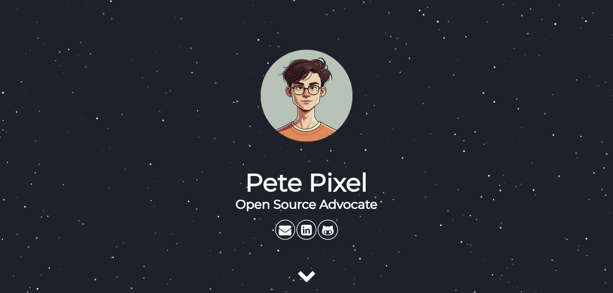

# Personal Website 

This project is a fork of the [Jekyll Theme Minimal Resume](https://github.com/murraco/jekyll-theme-minimal-resume) by [murraco](https://github.com/murraco).
I've customized and enhanced it to create my personal website, and I'm open-sourcing it in case it's useful for others.

**Key changes and features:**

* Add profile picture
* New layout for expertise section
* Detailed resumee with education, working experience and publications 

Check the [live demo](https://massimilianobotticelli.github.io/jekyll-resume-webiste/) or my [personal resumee](https://massimilianobotticelli.me/).

# Screenshot

  

## Getting Started

1. **Fork this repository** and clone your fork.
2. **Install Jekyll:** `gem install jekyll bundler`
3. **Edit `_config.yml`** to personalize your site.
4. **Run locally:**
   - `bundle install`
   - `bundle exec jekyll build`
   - `bundle exec jekyll serve`

## Customization

* **Content:** Edit the `_data/resume.yml` and the `_config.yml` to add your own information, skills, experience, and social links.
* **Styling:** Customize the colors and styles by modifying the `.sass` files.

## Contributing

Feel free to contribute to this project by:

* Reporting issues
* Opening pull requests with improvements
* Spreading the word

## Credits

* **Original Theme:** [Jekyll Theme Minimal Resume](https://github.com/murraco/jekyll-theme-minimal-resume) by [murraco](https://github.com/murraco)

## License

MIT License

Copyright © 2017 Mauricio Urraco

Copyright © 2024 Massimiliano Botticelli